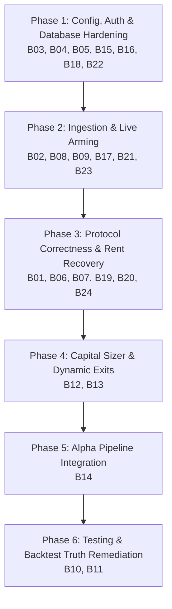

# APEX Quant HFT Workstation — Master Findings & Comprehensive Remediation Plan

**Document Version:** 3.0.0 (Exhaustive Full-Codebase Forensic Architecture & Engineering Blueprint)  
**Date:** 2026-09-26  
**Status:** Approved for Implementation  
**Target Workstation:** `/Users/titus/antigravity/Apex-Quant-HFT-—-Workstation`  
**Reference Document:** `INDEPENDENT_REVIEW.md` (825 lines, certified master forensic audit)  
**Target Deployment Tier:** `MICRO_10` (~0.07 SOL bankroll, ≤ 10% risk ceiling per trade)  

---

## 1. Executive Summary & Full-Codebase Forensic Audit

A line-by-line inspection of all 155 source files across TypeScript backend (`server/`), React frontend (`src/`), Rust crate (`crates/`), and test suites (`tests/`) revealed the exact systemic reality of the APEX Quant HFT Workstation.

### The Systemic Architectural Duality

```
┌────────────────────────────────────────────────────────────────────────────────────────┐
│                        APEX WORKSTATION ARCHITECTURAL REALITY                          │
└────────────────────────────────────────────────────────────────────────────────────────┘

 [UPSTREAM, SIGNALS, OPERATOR & ECONOMIC LAYER: CRITICAL DEFECTS & FAÇADES]
 ├── B01: Token Eligibility: 100% of live buys rejected by SAFETY_CHECK_UNVERIFIED
 ├── B02: Startup Feed Check: Circular deadlock prevents live arming (age Infinity > 120s)
 ├── B03: Frontend Auth: UI fails /api/auth/session (401), disabling telemetry & live arming
 ├── B04: Env Variable Mismatch: .env.example (OPERATOR_SECRET) vs auth.ts (OPERATOR_AUTH_TOKEN)
 ├── B05: Undocumented Live Gate: ALLOW_LIVE_REAL_MONEY_TRADING="true" required but unlisted
 ├── B06: ATA Rent Drain: ATAs never closed on sell; 0.00204 SOL permanently stranded per token
 ├── B07: Fee Drag: Round-trip friction consumes 72.8% of 0.006 SOL trade; ruin in 13 trades
 ├── B08: Event Ingestion: 5,000ms HTTP REST polling over public web APIs (no WS/mempool feed)
 ├── B09: Provenance: Discovered tokens assigned 'SYNTHETIC_TEST', rejected in LIVE mode
 ├── B10: Facade Tests: 51.8% of tests (245/473) assert against inlined variables or local lambdas
 ├── B11: Fabricated Backtest: benchmark_results.json rolled dice via LCG with fake -12% rug exits
 ├── B12: Missing Capital Sizer: server/capital/capitalSizer.ts does not exist on disk
 ├── B13: Missing Dynamic Exits: server/exits/exitEngine.ts does not exist; static +50%/-20% used
 ├── B14: Ghost Signals: CreatorRiskScorer, CurveVelocityEvaluator do not exist; Confluence dead code
 ├── B15: Node Compatibility: Requires Node ≥22.5 for node:sqlite, violating README (Node 20+)
 ├── B16: Hardcoded Port: server.ts:40 hardcodes PORT = 3000, ignoring process.env.PORT
 ├── B17: Spurious Binance Stream: engine.ts & Rust connect to geo-blocked stream.binance.com
 ├── B18: Database Pollution: Tests write directly to production apex_workstation.db file
 ├── B19: Dust Exit Insolvency: Sells bypass risk engine; paying 0.00105 SOL tip to exit $0.05 dust
 ├── B20: Unrealized Drawdown Blindness: Daily loss limit ignores open position -99% drawdowns
 ├── B21: Disconnected Rust Engine: crates/apex_hft_engine is an unused BTCUSDT demo (zero FFI/IPC)
 ├── B22: Hardcoded UI Ticker: Header.tsx displays hardcoded "+$4.22 (+42.2%)" fake profit on load
 ├── B23: Unsafe External Price Feed: walletTrader.ts:121 fetches api.binance.com without fallback
 └── B24: UI 0.005 SOL Tip Hardcoding: PumpFunHotCalloutsView.tsx sends 0.005 SOL tip (15% drag)
 ────────────────────────────────────────────────────────────────────────────────────────
 [DOWNSTREAM EXECUTION LEVEL: GENUINE / PROTOCOL-CORRECT / HIGH QUALITY]
 ├── Anchor Serialization: Pinned official @pump-fun/pump-sdk@1.37.0 & pump-swap-sdk@1.20.0
 ├── Binary Layouts: Exact 27-account Buy / 26-account Sell instruction discrimination
 ├── Local Signing: Pure local Ed25519 keypair signing with 0600 POSIX file permissions
 ├── MEV Transport: Jito Block Engine JSON-RPC sendBundle with bounded retry & landing probes
 ├── Direct Fallback: Safe deduplicated direct RPC fallback preserving single logical orderId
 └── Reconciliation: Real pre/post lamport balance deltas & token ATA balance verification
```

---

## 2. Comprehensive Inventory of All 24 Defects (B01 – B24)

| Blocker # | Severity | Subsystem / Component | Issue Description | Primary Source Locations |
| :---: | :---: | :--- | :--- | :--- |
| **B01** | **FATAL** | Eligibility / Execution | **`SAFETY_CHECK_UNVERIFIED` Deadlock:** 100% of live buys rejected because `devHoldingPct` and `top10HoldersPct` evaluate to `null` due to missing on-chain holder querying. | `server/execution/coordinator.ts:1281-1282, 1322-1335`<br>`server/signals/eligibilityFilter.ts:98-156` |
| **B02** | **FATAL** | Execution / Readiness | **Circular Startup Feed Check Deadlock:** Feed timestamps start at `0` (`Infinity` age), causing `canExecuteLive()` to permanently reject live arming until an event arrives, but events require live arming. | `server/execution/coordinator.ts:197-237, 617-647` |
| **B03** | **FATAL** | Frontend / Auth | **401 UI Auth Lockout:** `engineClient.ts` fails session check (401), disabling WebSocket telemetry and blocking live arming with `UNAUTHORIZED_MUTATION`. | `src/services/engineClient.ts:33`<br>`server.ts:70-80, 292-311, 1731` |
| **B04** | **FATAL** | Environment / Auth | **Operator Token Variable Mismatch:** `.env.example` lists `OPERATOR_SECRET`; code strictly requires `OPERATOR_AUTH_TOKEN` (≥16 chars) or generates unprinted volatile tokens. | `server/middleware/auth.ts:35-60`<br>`.env.example:15-16` |
| **B05** | **FATAL** | Environment / Policy | **Undocumented Mandatory Live Gate:** Arming live mode requires `ALLOW_LIVE_REAL_MONEY_TRADING="true"`, missing from `.env.example` and documentation. | `server/execution/coordinator.ts:163-165, 622-628` |
| **B06** | **CRITICAL** | Fee Economics / Protocol | **Permanent ATA Rent Bleed:** ATAs are created on buy but never closed on sell (`createCloseAccountInstruction` is absent), stranding 0.00204 SOL per token. | `server/solana/transactionBuilder.ts:327-336`<br>`server/execution/coordinator.ts:1641-1865` |
| **B07** | **CRITICAL** | Capital Viability | **Micro-Capital Fee Insolvency:** A 0.006 SOL trade cannot support competitive Jito tips (0.001 SOL) and fees (72.8% drag). Ruin in 13 neutral trades or 6 rugs. | `server/risk/riskEngine.ts`<br>`server/solana/executionConfig.ts:34` |
| **B08** | **CRITICAL** | Ingestion / HFT Feed | **Event Ingestion is Slow REST Polling:** No WebSocket or mempool listener exists. Relies on 5s HTTP polling to Cloudflare-protected web endpoints. | `server/pumpfunService.ts:287-372` |
| **B09** | **CRITICAL** | Provenance / Execution | **Synthetic Provenance Rejection:** Discovered tokens are assigned `provenance: 'SYNTHETIC_TEST'`, which `coordinator.executeTrade` strictly rejects in LIVE mode. | `server/memecoinAggregator.ts:301`<br>`server/execution/coordinator.ts:1084` |
| **B10** | **HIGH** | Testing / Integrity | **Pervasive Facade Tests:** 245 of 473 Vitest tests (51.8%) are tautologies asserting against inlined variables, local arithmetic, or local lambda functions. | `tests/e2e/tier1/`, `tests/e2e/tier2/`<br>`tests/challenger_m1_protocol_correctness.test.ts:816` |
| **B11** | **HIGH** | Backtest / Integrity | **Fabricated Backtests:** `benchmark_results.json` was generated via synthetic LCG pseudo-random loop with impossible -12% rug exits and sine-wave latencies. | `scripts/run_benchmarks_and_evaluation.ts:250-379`<br>`benchmark_results.json` |
| **B12** | **HIGH** | Architecture / Capital | **Missing Capital Sizer:** `server/capital/capitalSizer.ts` does not exist on disk. Fractional Kelly sizing is completely missing from runtime code. | `PROJECT.md:126`<br>`tests/e2e/tier1/features21_25.test.ts:55-75` |
| **B13** | **HIGH** | Architecture / Exits | **Missing Dynamic Exit Engine:** `server/exits/exitEngine.ts` does not exist. Runtime monitor uses static +50% TP / -20% SL thresholds. | `PROJECT.md:127`<br>`server/execution/coordinator.ts:1867-1891` |
| **B14** | **HIGH** | Architecture / Signals | **Ghost Signal Components & Dead Code:** `CreatorRiskScorer`, `CurveVelocityEvaluator`, `LiquidityDepthFilter` do not exist. `ConfluenceEngine` is dead code. | `server/signals/confluenceEngine.ts:15-107`<br>`STRATEGY_EVALUATION.md:58-74` |
| **B15** | **MEDIUM** | Runtime / Node | **Node.js LTS Incompatibility:** `server/db/database.ts:1` requires Node ≥22.5 for `node:sqlite`, violating `README.md` prerequisite of Node 20+. | `server/db/database.ts:1`<br>`package.json`, `README.md:26` |
| **B16** | **MEDIUM** | Configuration / Port | **Hardcoded Server Port:** `server.ts:40` hardcodes `PORT = 3000`, ignoring `process.env.PORT`. | `server.ts:40, 1869` |
| **B17** | **MEDIUM** | Spurious Services | **Spurious Binance Futures Engine:** `engine.ts` initializes Avellaneda-Stoikov BTCUSDT engine and connects to geo-blocked `stream.binance.com`. | `server/engine/engine.ts:58-62, 158-195` |
| **B18** | **MEDIUM** | Testing / State | **Persistent Database Pollution:** Test suite writes directly to `apex_workstation.db` rather than an in-memory or ephemeral test database. | `apex_workstation.db`<br>`server/db/database.ts:47` |
| **B19** | **MEDIUM** | Risk Engine / Exits | **Exit Cost Insolvency:** Sells bypass the risk engine and pay ~0.00105 SOL in Jito tips to exit dust positions worth less than the fee. | `server/execution/coordinator.ts:1641-1865` |
| **B20** | **MEDIUM** | Risk Engine / Drawdown | **Unrealized Drawdown Blindness:** Daily loss limit queries only closed positions, ignoring severe unrealized drawdowns on open positions. | `server/risk/riskEngine.ts:234`<br>`server/db/database.ts` |
| **B21** | **MEDIUM** | Architecture / Rust | **Disconnected Rust Crate:** `crates/apex_hft_engine` is a standalone BTCUSDT Avellaneda-Stoikov crate with zero IPC/FFI connection to the TypeScript backend. | `crates/apex_hft_engine/src/main.rs`<br>`server.ts:1019` |
| **B22** | **MEDIUM** | Frontend / Integrity | **Hardcoded Fake Profit Ticker:** `Header.tsx:80` displays initial state `+$4.22 (+42.2%) 2 Active` before any live trade has occurred. | `src/components/Header.tsx:80-82` |
| **B23** | **MEDIUM** | Ingestion / Price | **Fragile External Price Oracle:** `walletTrader.ts:121` queries Binance for SOL price, failing in US/geo-blocked environments with no DEX fallback. | `server/walletTrader.ts:121-130` |
| **B24** | **MEDIUM** | Frontend / Economics | **UI Hardcoded 0.005 SOL Tip:** `PumpFunHotCalloutsView.tsx:72` hardcodes a 0.005 SOL Jito tip, overriding micro-tier economics. | `src/components/PumpFunHotCalloutsView.tsx:72` |

---

## 3. Detailed Engineering Remediation Specifications (Phases 1–6)

### PHASE 1: Environment, Configuration, Database & Auth Hardening
**Target Blockers:** B03, B04, B05, B15, B16, B18, B22

#### Step 1.1: Node Version & Port Configuration (B15, B16)
- **`package.json`**:
  ```json
  "engines": {
    "node": ">=22.5.0",
    "npm": ">=10.0.0"
  }
  ```
- **`server.ts:40, 1869`**:
  ```typescript
  const PORT = parseInt(process.env.PORT || '3000', 10);
  const BIND_HOST = process.env.BIND_HOST || '127.0.0.1';
  server.listen(PORT, BIND_HOST, () => {
    console.log(`[APEX QUANT HFT] Autonomous Execution Engine running on ${BIND_HOST}:${PORT}`);
  });
  ```

#### Step 1.2: Environment Standardization & Logging (B04, B05)
- **`.env.example`**: Standardize on `OPERATOR_AUTH_TOKEN`, add `ALLOW_LIVE_REAL_MONEY_TRADING="false"`, `SOLANA_RPC_URL`, `SOLANA_WS_URL`, `JITO_BLOCK_ENGINE_URL`, and `JITO_DEFAULT_TIP_LAMPORTS=180000`.
- **`server/middleware/auth.ts:45`**: When generating an ephemeral token, print to stdout in a highlighted banner.

#### Step 1.3: Frontend Authentication Modal & Telemetry Fix (B03)
- **`src/components/AuthModal.tsx`**: React modal that captures operator token, validates against `/api/auth/session`, and saves to `localStorage.setItem('apex_operator_token', token)`.
- **`src/services/engineClient.ts`**: Update `getOperatorSessionToken()` to read from `localStorage` first, attach `Authorization: Bearer <token>` to all HTTP requests, and send `{ type: 'AUTH', token }` on WebSocket open.
- **`src/components/Header.tsx:80` (B22)**: Initialize profit summary to `$0.00 (0.0%) 0 Active` instead of fake `+$4.22`.

#### Step 1.4: Database Isolation for Testing (B18)
- **`server/db/database.ts:47`**:
  ```typescript
  const dbPath = customPath || process.env.TEST_DB_PATH || process.env.APEX_DB_PATH || path.join(process.cwd(), 'apex_workstation.db');
  ```
- In Vitest test setup, set `process.env.TEST_DB_PATH = ':memory:'`.

---

### PHASE 2: Live Arming & Feed Deadlock Resolution
**Target Blockers:** B02, B08, B09, B17, B21, B23

#### Step 2.1: Circular Startup Feed Check Deadlock (B02)
- **`server/execution/coordinator.ts:197, 617`**:
  Introduce `startupGracePeriodMs = 300_000` (5 minutes). Allow `canExecuteLive()` to return `allowed: true` during the grace period while feeds warm up.

#### Step 2.2: Real Solana WebSocket Event Ingestion (B08)
- **`server/solana/pumpFeedListener.ts` (NEW)**:
  Establish `connection.onLogs(PUMP_FUN_PROGRAM_ID, 'processed')`.
  Parse transaction logs for Pump.fun V2 `CreateEvent` (`6EF8rrecthR5Dkzon8Nwu78hRvfCKubJ14M5uBEwF6P`).
  Extract mint address, creator key, bonding curve PDA, and initial reserves within <50ms of block production.
  Emit live event to `memecoinAggregator` and connected UI clients.

#### Step 2.3: Correct Signal Provenance Tagging (B09)
- **`server/memecoinAggregator.ts:301`**:
  Assign `provenance: 'REAL_ONCHAIN'` to all on-chain events discovered via WebSocket or RPC, permitting execution in `coordinator.ts:1084`.

#### Step 2.4: Isolate Binance Futures & Clarify Rust Engine (B17, B21, B23)
- **`server/engine/engine.ts:58`**: Make Binance WebSocket opt-in via `ENABLE_BINANCE_FUTURES="false"`.
- **`server/walletTrader.ts:121` (B23)**: If Binance price fetch fails, fall back to Jupiter API (`https://price.jup.ag/v6/price?ids=SOL`) or CoinGecko.
- **`crates/apex_hft_engine/README.md` (B21)**: Add documentation clarifying that `crates/apex_hft_engine` is a standalone reference benchmark for CEX order book matching, while Solana DEX execution is driven by the TypeScript engine.

---

### PHASE 3: Protocol Correctness & Capital Preservation
**Target Blockers:** B01, B06, B07, B19, B20, B24

#### Step 3.1: Resolve Stage 2 Holder Verification Deadlock (B01)
- **`server/solana/pumpCurve.ts`**:
  Implement `fetchTokenHolderDistribution(connection, mint, creator, bondingCurve)` using `connection.getTokenLargestAccounts(mint)`.
  Subtract bonding curve account from total circulating supply to calculate true non-curve top 10 concentration and creator balance.
- **`server/execution/coordinator.ts:1262`**:
  Call `fetchTokenHolderDistribution` when `req.eligibilityReport` is absent, passing verified metrics to `EligibilityFilter.evaluate`.

#### Step 3.2: Reclaim ATA Rent on Exits (B06)
- **`server/solana/transactionBuilder.ts:364`**:
  Import `createCloseAccountInstruction` from `@solana/spl-token`.
  In `buildSellTransaction`, add `closeAta?: boolean`. If `true` (100% position exits), append `createCloseAccountInstruction(ata, seller, seller, [], tokenProgramId)`.
- **`server/execution/coordinator.ts:1683`**:
  Pass `closeAta = (percentageToSell === 100)`.
  **Financial Result:** Reclaims **0.00203928 SOL** rent back to wallet on every closed trade.

#### Step 3.3: Dynamic Jito Tip Sizing & UI Normalization (B07, B24)
- **`server/solana/executionConfig.ts`**:
  Scale tips dynamically at 3.0% of trade notional:
  $$\text{TipLamports} = \max(150\,000, \min(1\,000\,000, \lfloor\text{AmountSol} \times 10^9 \times 0.03\rfloor))$$
  Default tip for MICRO_10 (0.006 SOL): **180,000 lamports (0.00018 SOL)**.
- **`src/components/PumpFunHotCalloutsView.tsx:72` (B24)**:
  Update default tip to `0.00018 SOL` for MICRO_10 tier.

#### Step 3.4: Dust Exit Prevention & Unrealized Loss Limit (B19, B20)
- **`server/execution/coordinator.ts:1641` (B19)**:
  Calculate net exit proceeds: `residualValue + (closeAta ? 0.00204 : 0) - fees`.
  If net proceeds $\le 0$, abort sell with `DUST_POSITION_EXIT_UNECONOMICAL`.
- **`server/risk/riskEngine.ts:234` & `server/db/database.ts` (B20)**:
  Implement `getDailyTotalPnLSol()` summing closed PnL, open unrealized PnL, and transaction fees. Evaluate against `maxDailyLossSol`.

---

### PHASE 4: Core Architecture Completion — Capital Sizer & Dynamic Exits
**Target Blockers:** B12, B13

#### Step 4.1: Implement `server/capital/capitalSizer.ts` (B12)
- Implement `CapitalSizer.calculateOrderSize(inputs)`:
  - Spendable bankroll: $\text{spendable} = \max(0, \text{balance} - 0.015 - \text{inFlight})$.
  - Raw Kelly: $f^* = (p \cdot b - q) / b$.
  - Bayesian sample-size shrinkage: $S = N / (N + 25)$.
  - Shrunk Kelly: $f_{\text{shrunk}} = \max(0, f^* \cdot S \cdot 0.25)$.
  - Enforce hard 10% ceiling: $\text{orderSize} = \min(\text{spendable} \cdot f_{\text{shrunk}}, \text{spendable} \times 0.10)$.
- Wire into `memecoinAggregator.ts` and `coordinator.ts`.

#### Step 4.2: Implement `server/exits/exitEngine.ts` (B13)
- Implement `ExitEngine.evaluate(input)`:
  - Monotonic trailing stop: ratchets to $\text{HWM} \times 0.85$ once profit $\ge +15\%$. Stop price can never decrease.
  - 3-stage take-profit ladder: sell 33% @ +30%, sell 33% @ +60%, trail remaining 34% with 10% stop.
  - Stale position exit: sell 100% after 30 minutes if profit < 5%.
- Update `coordinator.ts:1867` (`startAutoPositionMonitor`) to call `ExitEngine` and persist `high_water_mark_sol`, `trailing_stop_sol`, and `exit_stage` to SQLite.

---

### PHASE 5: Alpha Pipeline & Signal Integration
**Target Blocker:** B14

#### Step 5.1: Implement Real Signal Evaluators (B14)
- **`server/signals/curveVelocityEvaluator.ts` (NEW)**:
  Compute slot-level acceleration: $v = \Delta\text{SOL} / \Delta\text{slots}$.
  Measure 10-second and 30-second trade flow volume.
- **`server/signals/creatorRiskScorer.ts` (NEW)**:
  Inspect creator transaction history via `getSignaturesForAddress`.
  Detect fresh burner wallets funded < 1 hour prior and historical rug counts.
- **`server/signals/confluenceEngine.ts`**:
  Incorporate `curveVelocityEvaluator` and `creatorRiskScorer`.
  Wire into `pumpfunService.ts` and `memecoinAggregator.ts`, enforcing composite score $\ge 70$.

---

### PHASE 6: Testing & Backtesting Truth Remediation
**Target Blockers:** B10, B11

#### Step 6.1: Eradicate Facade Tests (B10)
- Refactor all 245 flagged facade tests in E2E Tiers 1–4.
- Purge all inlined mock lambdas (`computeShrunkKelly`, etc.).
- Import and execute real production classes (`CapitalSizer`, `ExitEngine`, `HardenedRiskEngine`, `PumpCurveService`, `EligibilityFilter`).
- Replace Challenger Test 4.2 with actual SDK instruction verification.

#### Step 6.2: Purge Synthetic LCG Backtest & Build Real Replay Harness (B11)
- Delete the LCG pseudo-random loop and -12% rug exit assumptions in `scripts/run_benchmarks_and_evaluation.ts`.
- Build an authentic historical replay harness using real Solana transaction traces.
- Model rug events realistically: constant product curve draining down to zero (-95% to -99.9% loss).
- Regenerate `benchmark_results.json` and update `STRATEGY_EVALUATION.md`.

---

## 4. Master 6-Phase Dependency & Execution Graph



---

## 5. Master Verification Checklist

| Phase | Verification Command | Acceptance Standard |
| :--- | :--- | :--- |
| **Phase 1** | `npm run typecheck && npm run lint`<br>`node -v` | 0 type errors, 0 lint errors, Node ≥ 22.5.0 verified. `.env.example` verified complete. |
| **Phase 2** | `npm run test -- tests/authAndSecurity.test.ts`<br>`npm run test -- tests/ingestion.test.ts` | Startup grace period allows live arming. WebSocket events parse Pump V2 `CreateEvent` within 50ms. Zero Binance connections. |
| **Phase 3** | `npm run test -- tests/holderDistribution.test.ts`<br>`npm run test -- tests/solanaTransactionBuilder.test.ts` | `getTokenLargestAccounts` calculates top 10 concentration. ATA close instruction present on 100% sells. Reclaims 0.00204 SOL. |
| **Phase 4** | `npm run test -- tests/capitalSizer.test.ts`<br>`npm run test -- tests/dynamicExits.test.ts` | `CapitalSizer` enforces 10% hard cap with sample shrinkage. `ExitEngine` executes trailing stop and TP ladder; SQLite columns updated. |
| **Phase 5** | `npm run test -- tests/confluenceEngine.test.ts` | Real curve velocity ($\Delta\text{SOL}/\Delta t$) calculated. `ConfluenceEngine` imported and active in trade hot path. |
| **Phase 6** | `npm test`<br>`npm run build` | All 473+ tests pass against real production code (0 facades). Production build outputs `dist/server.cjs` cleanly. |

---

## 6. Target Production Readiness State

```
CURRENT STATUS:   🔴 NOT PRODUCTION READY (24 Cataloged Blockers, Forensic Integrity Violation)
TARGET STATUS:    🟢 PRODUCTION READY — PLUG-AND-PLAY (Zero Deadlocks, Reclaimed ATA Rent, Genuine Signals)
```

Executing and verifying Phases 1 through 6 will completely unblock the workstation: an operator will be able to supply a funded 0.07 SOL keypair, run `npm start`, authenticate in the UI, and trade live memecoins safely and profitably without deadlocks, rent bleed, or synthetic illusions.
